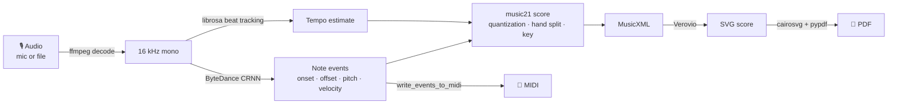

# 🎹 NotesScripter

Play the piano, get the sheet music — **entirely on your device**. Audio is recorded (or
uploaded) in a local web app, transcribed with the ByteDance high-resolution piano
transcription model, quantized into notation, and exported as **PDF, MIDI and MusicXML**.
Nothing is ever sent to a server: the app binds to `127.0.0.1` only.

## Quick start

```bash
uv sync
uv run notes-scripter serve   # opens http://127.0.0.1:8321 in your browser
```

Record from the microphone, start a **live session** (the score appears as you play,
~10 s behind, with a full-quality pass when you stop), or drop an audio file
(WAV, MP3, FLAC, OGG, WebM…). Leading/trailing silence is trimmed automatically.
The first transcription downloads the model checkpoint (~165 MB) to
`~/piano_transcription_inference_data/`; after that everything works offline.

To touch up a transcription, download the MusicXML and open it in MuseScore or any
notation editor.

There is also a CLI:

```bash
uv run notes-scripter transcribe recording.wav --out output/
```

## How it works



### Effort levels

Inference slides a 10-second window over the recording; the **effort** setting controls
how much the windows overlap and get averaged:

| Effort | Window hop | Speed | When to use |
|---|---|---|---|
| ⚡ Fast | 100% (no overlap) | ~2× faster | Quick drafts |
| ⚖️ Balanced (default) | 50% | baseline | Everyday use |
| ✨ Best | 25% | ~2× slower | Final scores, dense passages |

Available in the UI (segmented control) and the CLI (`--effort fast|balanced|best`).

- `src/notes_scripter/transcribe.py` — audio decoding (ffmpeg), silence trimming, tempo estimation, model inference
- `src/notes_scripter/score.py` — 16th-note quantization, chord grouping, hand split at middle C, key detection
- `src/notes_scripter/render.py` — MusicXML → SVG pages → PDF
- `src/notes_scripter/pipeline.py` — orchestration: quantized notes → score → all exports
- `src/notes_scripter/server.py` — local FastAPI app: transcription jobs, live sessions, static UI (Vue 3 vendored)
- `src/notes_scripter/cli.py` — `serve` and `transcribe` commands

Live mode records in the browser and posts the audio to `127.0.0.1` every few seconds;
each complete 10-second block is transcribed once (fast tier) and the draft score is
re-rendered. Stopping triggers a normal transcription of the whole take at your selected
effort tier.

## Development

```bash
uv run pytest              # fast tests (no model needed)
uv run pytest -m slow      # full end-to-end test (downloads the model)
uv run ruff format . && uv run ruff check .
git config core.hooksPath .githooks   # enable the pre-commit checks
```

## Roadmap

See `docs/research-report.md` — notably per-piano calibration, smartphone-domain
robustness, a real MIDI-to-score model (PM2S-style), and precision-tiered "effort" levels.
